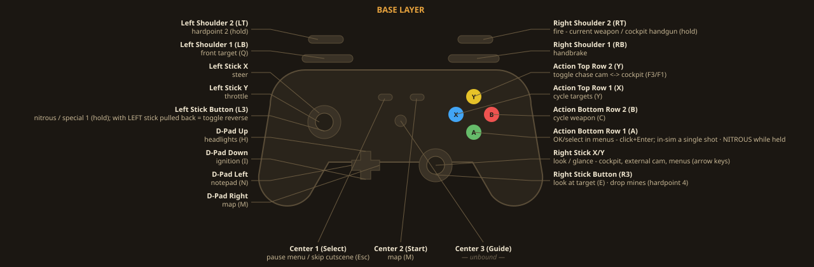
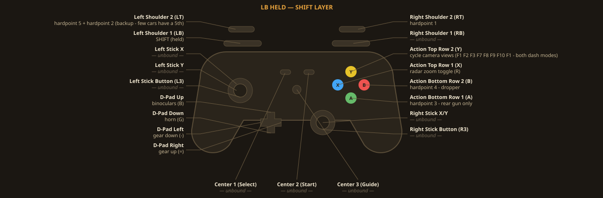

# i76-everywhere

**Interstate '76 (GOG Gold, 1997) running well on everything: Apple Silicon Macs, Steam Deck,
and modern Windows — plus a full save editor and the reverse-engineered file formats.**

This repo ships **no copyrighted game files**. You bring your own GOG copy; everything here is
scripts, source, and documentation. Downloaded/copyrighted material lives in a local, gitignored
`game-data/` folder.

## Start here

| You want to… | Go to |
|---|---|
| **Play on a Mac** (Apple Silicon) | [docs/MAC-BUILD.md](docs/MAC-BUILD.md) — the shipping build: software renderer via DxWnd in a self-contained Wine wrapper. Instant start, music, clean quit, 20 FPS physics-safe |
| **Play on a Steam Deck** | [docs/STEAMDECK.md](docs/STEAMDECK.md) — the pretty Glide path (dgVoodoo→Vulkan) + force feedback |
| **Play on Windows** | [docs/WINDOWS-PLAYBOOK.md](docs/WINDOWS-PLAYBOOK.md) — max graphics, FFB, frame-gen |
| **Edit your saves** (no install) | **[Open the save editor in your browser →](https://therealjkvalentine.github.io/i76-everywhere/i76-save-editor.html)** — drag a save in, download it back out. Details: [the save editor](#the-save-editor) |
| **Understand the file formats** | [i76-save-editor.py](i76-save-editor.py) docstring (save format) + [docs/HD-TEXTURES-RESEARCH.md](docs/HD-TEXTURES-RESEARCH.md) (ZFS/VQM/M16) |
| **Know what's already settled** | [docs/README.md](docs/README.md) — the doc map: what works, what's a parked dead end. **Read before re-chasing anything** |
| **Every fix, one table** | [docs/VERIFIED-FIXES.md](docs/VERIFIED-FIXES.md) — symptom → root cause → fix, all verified in play |

## Open improvements

Live backlog of things still worth fixing, **non-frame-rate** ones first because they affect
normal play at any frame rate. (Frame-rate-specific bugs have their own tracked list in
[`../i76-uncap-lab/docs/framerate/MEASUREMENTS.md`](../i76-uncap-lab/docs/framerate/MEASUREMENTS.md).)

> **Sitting down to test?** [docs/READY-TO-TEST.md](docs/READY-TO-TEST.md) — the one-page checklist of
> what's deployed to the portable install and exactly what to click, including the save/mouse fix, the
> 60 fps camera, and the save-name typing question still open.

| # | Issue | Status / leads |
|---|---|---|
| 1 | **Saving/popups freeze the game** ("not responding") + the mouse does nothing / lands wrong | 🔧 **Root cause solved; v1 fix FAILED in play, v2 built 2026-08-16 and awaiting verification** — [docs/SAVE-FREEZE-ROOT-CAUSE.md](docs/SAVE-FREEZE-ROOT-CAUSE.md). The shell hit-tests raw `GetCursorPos` screen coords against its 640×480 button rects. The **`u32x` USER32 proxy** (`i76-uncap-lab/src/u32x.c`, deploy via `tools/instruments/deploy-shellfix.ps1`) translates screen↔640×480. **v1 shipped inert**: `FindWindowA` returned NULL (so it disabled itself), and its "value already in range → don't translate" guard mis-read black-bar coordinates, while its untranslated `ClipCursor` trapped the pointer in the physical top-left box — a self-reinforcing deadlock. **v2** finds the window via `EnumWindows` on our own PID and translates unconditionally from live geometry (identity when the window really is 640×480). Verify with the `-DU32X_LOG` build |
| 1b | **"Always says overwriting on a new save"** | Mechanism found (not the `save-01` allocator): the Save screen **pre-fills the name with the loaded bookmark's name**, so SAVE matches an existing entry → overwrite prompt. With the freeze fixed, YES now saves; a new slot needs a new name. Nicer fix (default a fresh name) deferred — see the doc |
| 1c | **Save-name text box is hard to type into** | A real, separate shell bug. **Mechanism traced** to `i76shell.dll+0x1D630`: a 64-entry ring buffer + `PeekMessageA(WM_KEYFIRST..WM_KEYLAST)` with its own `ToAscii` translation — a **focus/message-queue** path, not a poll. Untouched by the cursor proxy. "Works sometimes" = tracks window focus. **First live test: type at human speed into a focused window** (my synthetic input raced delivery and lost 4/5). Details in [docs/SAVE-FREEZE-ROOT-CAUSE.md](docs/SAVE-FREEZE-ROOT-CAUSE.md) |
| 2 | Shell/menu architecture background (why menus, garage, popups and save all behave alike) | [docs/SHELL-MENU-AND-SAVE-FREEZE.md](docs/SHELL-MENU-AND-SAVE-FREEZE.md) — one shell (`i76shell.dll`) drives them all |
| 3 | **Draw distance + texture LOD** — landscapes pop in late; high-res textures only appear close | ✅ **Draw distance CRACKED & sandbox-verified (2026-08-16) — [docs/DRAW-DISTANCE.md](docs/DRAW-DISTANCE.md).** Far clip is a per-mission WDEF field (all missions = 600 m) read through one global (`0x4C271C`); patched to any value + the fixed 512K render pool that crashed above ~3000 m enlarged 16×. Verified at 1800/5000 m, 60 fps flat, screenshots + soak tests. `patch-farclip.ps1`. Awaiting console eyeball test before portable deploy. Texture-LOD half deferred: far mips are hand-authored pak data (doc has the path) |

## The gamepad layout

The full controller scheme — native `input.map` bindings plus the AutoHotkey/XInput
layer (shift layer, look-back fire, rumble). These render from the **live configs**
via [tools/pad-diagram.py](tools/pad-diagram.py); regenerate after any binding change
(`open-pad-diagram.command` also gives an interactive HTML with the mouse/keyboard
tables) — never hand-edit them.

Design doctrine: [docs/CONTROL-DOCTRINE.md](docs/CONTROL-DOCTRINE.md) ·
Gamepad reference: [docs/GAMEPAD-PC-MAC.md](docs/GAMEPAD-PC-MAC.md)

## The save editor

A single self-contained web page styled after the game's garage paperwork.
**Zero-install:** [use it right now in any browser](https://therealjkvalentine.github.io/i76-everywhere/i76-save-editor.html)
— drag a save file in, edit, download it back out (nothing is uploaded; it all runs locally in the page).

- `./i76-save-editor.command` (Mac) — opens the editor with your saves auto-loaded and
  **writes edits straight back** (timestamped backups on every write; deletes are recoverable)
- `i76-save-editor.html` — the same page anywhere (Windows/Deck browser): drag saves in,
  download edits out
- `i76-save-editor.py` — the same parser as a terminal tool

What it edits: equipped parts (any weapon on any mount — off-spec swaps clearly marked),
armor (the DEFENSE panel numbers), every part's location (car/van/repair), condition, part
swaps with **measured DPS + range** on every weapon (data: Local Ditch), scene selection
("Scene № on a diner check"), save-as-slot, delete/restore. The save format was
reverse-engineered in this repo — details in the `.py` docstring.

## Highlights under the hood

- **Cutscene-music fix** ([smack-music-fix/](smack-music-fix/)): a proxy `SMACKW32.DLL` that
  recreates the 1997 CD-drive behavior (music stops when a movie starts) — fixes a GOG bug
  the community called unfixable. Ordinal-exact export forwarding; works on Mac and Windows.
- **Exactly-20 FPS physics** everywhere (the engine ties physics to framerate; scene 5's
  canyon jump is impossible above it): DxWnd delay on Mac, dgVoodoo `FPSLimit` on Deck/Windows.
- **The `.M16` hardware-texture format cracked** (round-trip encoder in
  [tools/i76img.py](tools/i76img.py)) — the RE prize from an enhanced-texture-pack
  experiment that was ultimately **retired** (marginal in-game gain; palette-indexed
  tiles break on night missions). Full writeup: [docs/HD-TEXTURES-RESEARCH.md](docs/HD-TEXTURES-RESEARCH.md).
- **The Voodoo path** (Glide→dgVoodoo→DXVK→MoltenVK→Metal) works but is **parked on Mac** —
  MoltenVK can't persist compiled pipelines. [docs/VOODOO-PARKED.md](docs/VOODOO-PARKED.md)
  has the exact announcement that would revive it.

## Provenance

Grown from [mac-gaming-ports](https://github.com/therealjkvalentine/mac-gaming-ports)'
`games/interstate-76/`, promoted to its own repo. Credits: UCyborg's AiO patch, dgVoodoo
(Dege), DxWnd (gho), Local Ditch Gaming (weapon measurements: Greg Schwartz / Zaphod-AVA),
the Open76 and Roanish/i76 reimplementation projects, and That Tony's format work.
