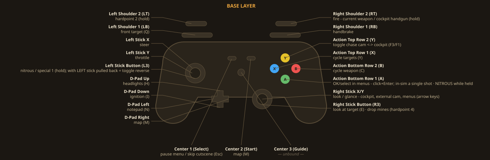
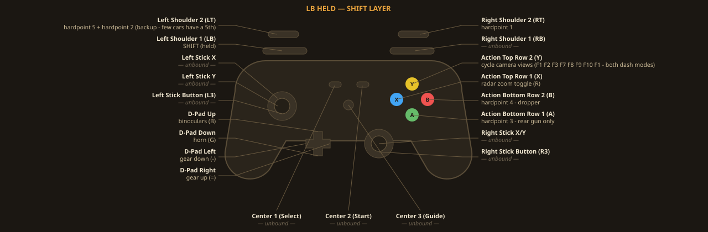

# i76-everywhere

**Interstate '76 (GOG Gold, 1997) running well on everything: Apple Silicon Macs, Steam Deck,
and modern Windows — plus a full save editor and the reverse-engineered file formats.**

This repo ships **no copyrighted game files**. You bring your own GOG copy; everything here is
scripts, source, and documentation. Downloaded/copyrighted material lives in a local, gitignored
`game-data/` folder.

## Start here

| You want to… | Go to |
|---|---|
| **Play on a Mac** (Apple Silicon) | [docs/MAC-BUILD.md](docs/MAC-BUILD.md) — the shipping build: software renderer via DxWnd in a self-contained Wine wrapper. Instant start, music, clean quit, 20 FPS physics-safe |
| **Play on a Steam Deck** | [docs/STEAMDECK.md](docs/STEAMDECK.md) — the pretty Glide path (dgVoodoo→Vulkan) + force feedback |
| **Play on Windows** | [docs/WINDOWS-PLAYBOOK.md](docs/WINDOWS-PLAYBOOK.md) — max graphics, FFB, frame-gen |
| **Edit your saves** (no install) | **[Open the save editor in your browser →](https://therealjkvalentine.github.io/i76-everywhere/i76-save-editor.html)** — drag a save in, download it back out. Details: [the save editor](#the-save-editor) |
| **Understand the file formats** | [i76-save-editor.py](i76-save-editor.py) docstring (save format) + [docs/HD-TEXTURES-RESEARCH.md](docs/HD-TEXTURES-RESEARCH.md) (ZFS/VQM/M16) |
| **Know what's already settled** | [docs/README.md](docs/README.md) — the doc map: what works, what's a parked dead end. **Read before re-chasing anything** |
| **Every fix, one table** | [docs/VERIFIED-FIXES.md](docs/VERIFIED-FIXES.md) — symptom → root cause → fix, all verified in play |

## Everything this adds

It is not only graphics. **[docs/ENHANCEMENTS.md](docs/ENHANCEMENTS.md)** is the one catalogue of every enhancement
in this repo, each with how to turn it on and how far it has been proven:

- **Controls**: the gamepad layout and its AutoHotkey shift layer, a CH Fighterstick layer, a force-feedback wheel,
  mouse driving, the Steam Deck layout, and an `input.map` lint.
- **Force feedback and haptics**: the game's own effects on a modern wheel, a custom wheel force model, bass
  shakers, pad rumble, and a telemetry feed for motion rigs.
- **Head tracking**: opentrack driving the in-game view.
- **Frame rate and simulation fixes**: 60 and 120 fps with the physics, AI and effects behaving as at 20.
- **Graphics**: supersampling and antialiasing, draw distance, frame generation, menu art tools.
- **Audio**: the CD soundtrack restored in missions, and the cutscene-music fix.
- **Bug fixes**, a **trainer**, the **save editor**, modding and reverse-engineering tools, and the
  **Mac / Steam Deck / Windows** install and packaging scripts.

Many items are opt-in or sandbox-only; the catalogue's evidence column says which.

## Playing at 60 / 120 fps

The game is 20 fps as GOG ships it. The music-fix proxy (`music-fix/Strlkup.dll`) carries an
opt-in switch set that makes it play well above that; `PLAY-i76.ps1 -Preset <name>` applies a
named set from [`presets/`](presets/) to the game process only (`-Preset ?` lists them,
`-DryRun` shows what the game would get without starting it; `LAUNCHER.ps1` has the same
drop-down). The default, `stock`, sets nothing.

| preset | what it sets | status |
|---|---|---|
| `stock` | nothing | [verified in play] the game as GOG ships it (the daily driver until 2026-10-03) |
| `smooth-60` | `I76_HIRES_CLOCK=1 I76_FIXED_STEP=24 I76_FRAMERATE_FIXES=1 I76_ENGINE_DT_FIX=1 I76_RENDER_INTERP=1` | [measured, sandbox] capture 014; [console-verified 2026-10-02, sandbox] n = 1 |
| `smooth-60-bugfixes` | smooth-60 + `I76_FIX_HEALTH_PCT=1 I76_FIX_LABEL_TABLE=1` | [measured, sandbox]; on in the 2026-10-02 console session |
| `smooth-120` | smooth-60-bugfixes + `I76_GLIDE_REFRESH=120` | [measured, sandbox] 120.1 fps; the same switches plus the 1800 m far clip were played by the owner at 120 on 2026-10-02 (as `best-120`) |
| `best-120` | smooth-120 + `I76_FAR_CLIP=1800`; `I76_COLL_DEDUPE=0`, `I76_AI_ROLL_HOLD=0` (count only, not measured) | [console-verified 2026-10-02, sandbox] by the owner; [measured] 120 fps through the trip menus; the preset of the daily driver built 2026-10-03 |
| `lab-all` | smooth-60-bugfixes + `I76_FAR_CLIP=1800 I76_TELEMETRY=1` (TEST-FRAMERATE mode 5) | [console-verified 2026-10-02, sandbox] n = 1 |

**State on 2026-10-03:** a new daily driver was built by `tools\Make-Daily-Driver.ps1` with `best-120` as its
preset ([docs/NEW-DAILY-DRIVER-RECIPE.md](docs/NEW-DAILY-DRIVER-RECIPE.md),
[docs/STATUS-2026-10-02.md](docs/STATUS-2026-10-02.md) last section); the installers in this repo still deploy
`stock`, and the other presets remain experimental until the A/B in
[docs/RELEASE-PLAN.md](docs/RELEASE-PLAN.md) section 7 is done. 120 fps is the ceiling of every renderer tested
([docs/RENDERER-ALTERNATIVES.md](docs/RENDERER-ALTERNATIVES.md) section 11). Two things have to be true
for a preset to do anything: the game folder's `Strlkup.dll` must be the current music-fix build
(the launcher compares it and tells you to run `setup-windows.ps1` if not; it copies nothing), and
GOG's `I76PATCH.DLL` (the 20 fps cap) must be renamed out of the way (the launcher only says so).
Per-switch evidence: [music-fix/README.md](music-fix/README.md); the 120 Hz analysis:
[docs/FPS-120.md](docs/FPS-120.md).

**Multiplayer is untested with any preset other than `stock`** (backlog P3-20): the fixed step and the
interpolation change when the simulation advances, and nobody has run two machines against each other with
them on. Play online on `stock` until someone has. (2026-10-03: the proxy's `I76_MULTI_INSTANCE=1` lets two
copies run on one PC, and two lab copies ran side by side; a multiplayer session between them was **not**
achieved: both copies need UDP port 21157, and the internet transport wants a game server.)

## Open work

There is no backlog table in this README any more (the one that stood here was a 2026-08-16 snapshot and kept
going stale). The live lists:

- **[docs/BACKLOG-2026-10-02.md](docs/BACKLOG-2026-10-02.md)**: every open problem and unknown in one prioritised
  table (P1 normal play, P2 the 60 fps experience, P3 release hygiene, P4 RE completeness), each row with its
  evidence state, what resolving it needs, and the cheapest next step.
- **[docs/STATUS-2026-10-02.md](docs/STATUS-2026-10-02.md)**: what the 2026-10-02 session built (with a
  2026-10-03 section for the new daily driver), how each item was verified, and what was left open or withdrawn.
- [docs/REPO-ORGANIZATION-PROPOSAL.md](docs/REPO-ORGANIZATION-PROPOSAL.md): a proposed tidier layout for this
  repo (nothing moved yet).
- [docs/RELEASE-PLAN.md](docs/RELEASE-PLAN.md) section 1 is the state table (what is deployed where);
  [docs/VERIFIED-FIXES.md](docs/VERIFIED-FIXES.md) is the record of what is fixed, with root causes.

The topics the old table covered, and where each lives now: saving / popups / menu mouse
([docs/SAVE-FREEZE-ROOT-CAUSE.md](docs/SAVE-FREEZE-ROOT-CAUSE.md), [u32x/README.md](u32x/README.md),
[docs/SHELL-MENU-AND-SAVE-FREEZE.md](docs/SHELL-MENU-AND-SAVE-FREEZE.md)); force feedback with wheel and bass
shakers ([tools/ffb/README.md](tools/ffb/README.md), backlog P3-17); draw distance and texture LOD
([docs/DRAW-DISTANCE.md](docs/DRAW-DISTANCE.md), [docs/FARCLIP-CAMERA-CRASH.md](docs/FARCLIP-CAMERA-CRASH.md)).

## The gamepad layout

The full controller scheme — native `input.map` bindings plus the AutoHotkey/XInput
layer (shift layer, look-back fire, rumble). These render from the **live configs**
via [tools/pad-diagram.py](tools/pad-diagram.py); regenerate after any binding change
(`open-pad-diagram.command` also gives an interactive HTML with the mouse/keyboard
tables) — never hand-edit them.

Design doctrine: [docs/CONTROL-DOCTRINE.md](docs/CONTROL-DOCTRINE.md) ·
Gamepad reference: [docs/GAMEPAD-PC-MAC.md](docs/GAMEPAD-PC-MAC.md)

## The save editor

A single self-contained web page styled after the game's garage paperwork.
**Zero-install:** [use it right now in any browser](https://therealjkvalentine.github.io/i76-everywhere/i76-save-editor.html)
— drag a save file in, edit, download it back out (nothing is uploaded; it all runs locally in the page).

- `./i76-save-editor.command` (Mac) — opens the editor with your saves auto-loaded and
  **writes edits straight back** (timestamped backups on every write; deletes are recoverable)
- `i76-save-editor.html` — the same page anywhere (Windows/Deck browser): drag saves in,
  download edits out
- `i76-save-editor.py` — the same parser as a terminal tool

What it edits: equipped parts (any weapon on any mount — off-spec swaps clearly marked),
armor (the DEFENSE panel numbers), every part's state (car/van/bench/salvage), condition, part
swaps with **measured DPS + range** on every weapon (data: Local Ditch), scene selection
("Scene № on a diner check"), save-as-slot, delete/restore. The save format follows the
game's own writer (`.py` docstring; `docs/SAVE-FORMAT-GAPS.md`); both editors round-trip every
sample save byte for byte and stay in lockstep (`python -m pytest tests/`). Status and the
open in-game checks: `docs/SAVE-EDITOR-STATUS-2026-10-02.md`.

## Highlights under the hood

- **Cutscene-music fix** ([smack-music-fix/](smack-music-fix/)): a proxy `SMACKW32.DLL` that
  recreates the 1997 CD-drive behavior (music stops when a movie starts) — fixes a GOG bug
  the community called unfixable. Ordinal-exact export forwarding; works on Mac and Windows.
- **20 FPS as shipped** everywhere by default (stock, the engine's behaviour changes with the frame rate; the
  60 / 120 fps switch set above is what corrects that): DxWnd delay on Mac, dgVoodoo `FPSLimit` on the Deck,
  GOG's `I76PATCH.DLL` on Windows. (Corrected 2026-10-03: this said dgVoodoo `FPSLimit` on Windows. The lab's
  "FPSLimit is ignored" result is void, measured while dgVoodoo was rejecting the sandbox conf; whether
  `FPSLimit` caps on Windows has not been re-measured.)
- **The `.M16` hardware-texture format cracked** (round-trip encoder in
  [tools/i76img.py](tools/i76img.py)) — the RE prize from an enhanced-texture-pack
  experiment that was ultimately **retired** (marginal in-game gain; palette-indexed
  tiles break on night missions). Full writeup: [docs/HD-TEXTURES-RESEARCH.md](docs/HD-TEXTURES-RESEARCH.md).
- **The Voodoo path** (Glide→dgVoodoo→DXVK→MoltenVK→Metal) works but is **parked on Mac** —
  MoltenVK can't persist compiled pipelines. [docs/VOODOO-PARKED.md](docs/VOODOO-PARKED.md)
  has the exact announcement that would revive it.

## Provenance

Grown from [mac-gaming-ports](https://github.com/therealjkvalentine/mac-gaming-ports)'
`games/interstate-76/`, promoted to its own repo. Credits: UCyborg's AiO patch, dgVoodoo
(Dege), DxWnd (gho), Local Ditch Gaming (weapon measurements: Greg Schwartz / Zaphod-AVA),
the Open76 and Roanish/i76 reimplementation projects, and That Tony's format work.
