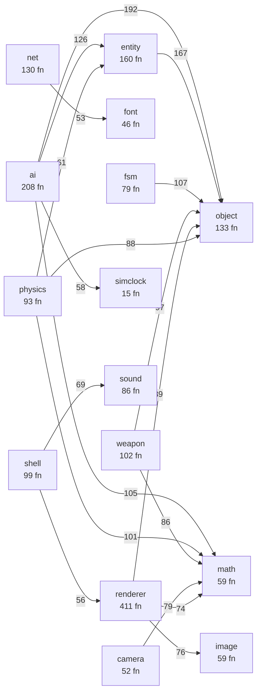
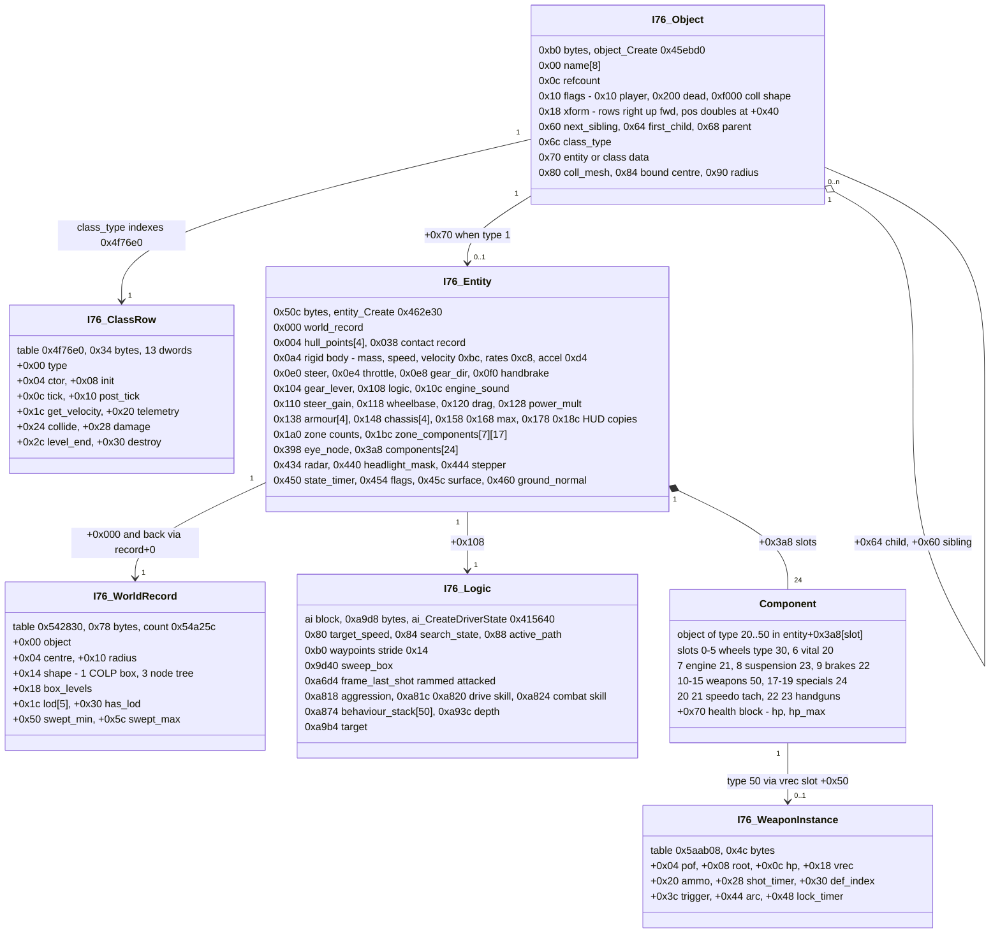
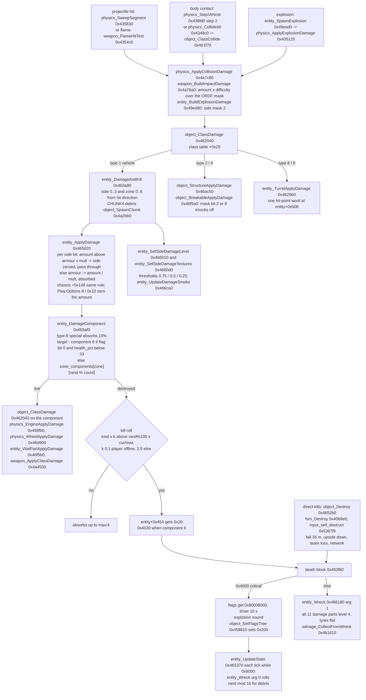
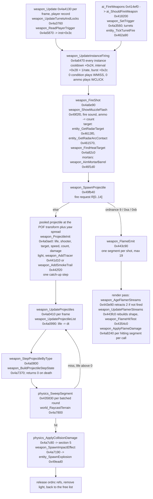
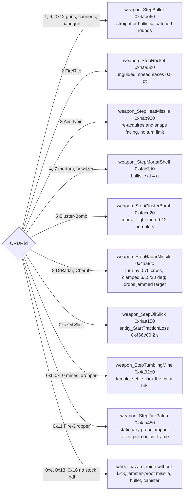
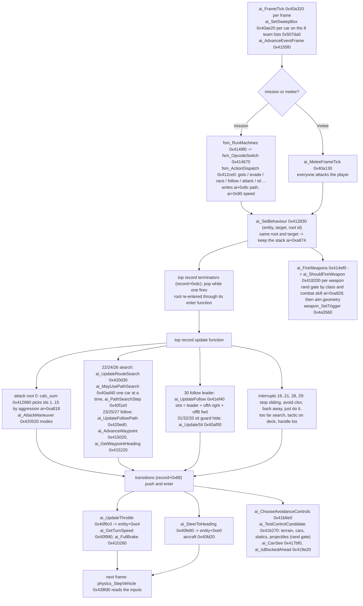

# Interstate '76 engine architecture (i76.exe, GOG, md5 9a232dcc2c164648cff20c414c1f9698)

The engine as a labelled binary shows it: which subsystems exist, how a frame runs through them, what the object model
looks like in memory, and how the four gameplay pipelines (physics, damage, weapons, AI) and the renderer are wired.
Every function name and address below is a row of `symbols/functions.tsv` (2,200 named functions; the `subsystem`
column is the name prefix). Every offset is a member of `types/i76_runtime.h`. The behaviour claims are the
subsystem specs' static readings of this one exe, with the live checks they record; this page does not add new
claims, it draws the existing ones. Numbers in section 1 come from `tools/callgraph_report.py` over
`ghidra/export/callgraph.json`; run it to regenerate them.

Conventions: addresses are pristine .text VAs (file offset = VA - 0x400c00). `entity` means the vehicle entity block at
object+0x70; `ai` means the driver block at entity+0x108; `obj+N` and `entity+N` are byte offsets. Diagrams are
Mermaid; GitHub renders them. Each diagram keeps to about 25 nodes, so long chains are split.

Contents: 1 module map; 2 frame sequence; 3 object model; 4 physics substep; 5 damage chain; 6 weapons and
projectiles; 7 AI behaviour loop; 8 renderer; 9 data files to runtime; 10 regenerating this page.

## 1. Module map

The exe is one statically linked C program (VC5, no classes in the C++ sense) whose functions fall into about 30
name prefixes. The prefixes are not arbitrary: `object` is the scene graph and class dispatch, `entity` is the
vehicle block hung off an object, `physics`/`weapon`/`ai`/`renderer` are the gameplay and drawing pipelines,
`bwd2` is the chunk-file loader, `shell` the boundary to i76shell.dll, `net` the ANet layer, and `math`, `world`,
`heap`, `vfs`, `simclock` are leaf services. The call matrix confirms that reading: `object` takes 873 cross-prefix
call sites and makes 140; `math` takes 526 and makes none; `ai` makes 633 and takes 40. The one thing the static
graph cannot see is pointer-table dispatch: the class table 0x4f76e0, the AI behaviour table 0x4c3e00, the FSM
action switch, the camera controller [0x4c2720], the renderer's draw-record and span tables, and the BWD2 chunk
tables. Section 1.4 adds those roots back by hand.

A port should know one thing about the map: `object` is the hub. Every list in the game (class lists, radar
contacts, sounds, smoke emitters, projectiles) holds counted object handles and re-validates them every frame
(`object_AddRef` 0x45ed00 / `object_Release` 0x45ef70), so an object can be freed while something still points at it.

### 1.1 Subsystems (generated)

| prefix | functions | bytes | calls out (cross) | calls in (cross) | internal calls |
|---|---:|---:|---:|---:|---:|
| renderer | 411 | 224331 | 545 | 273 | 964 |
| ai | 208 | 65124 | 633 | 40 | 344 |
| entity | 160 | 35965 | 473 | 419 | 149 |
| object | 133 | 29936 | 140 | 873 | 251 |
| net | 130 | 28441 | 300 | 140 | 286 |
| bwd2 | 107 | 26428 | 208 | 33 | 102 |
| weapon | 102 | 56151 | 422 | 73 | 135 |
| shell | 99 | 30756 | 274 | 28 | 78 |
| physics | 93 | 53023 | 351 | 136 | 159 |
| sound | 86 | 18590 | 98 | 195 | 132 |
| fsm | 79 | 25999 | 264 | 11 | 75 |
| math | 59 | 11265 | 0 | 526 | 29 |
| image | 59 | 19261 | 163 | 176 | 57 |
| camera | 52 | 19736 | 177 | 77 | 75 |
| input | 48 | 22050 | 190 | 23 | 38 |
| font | 46 | 10661 | 32 | 86 | 26 |
| vfs | 42 | 10705 | 49 | 204 | 47 |
| world | 40 | 6186 | 14 | 297 | 12 |
| heap | 31 | 1019 | 1 | 170 | 0 |
| startup | 19 | 4474 | 35 | 58 | 2 |
| simclock | 15 | 1524 | 19 | 202 | 5 |
| light | 12 | 4044 | 11 | 46 | 0 |
| zfs | 12 | 2499 | 7 | 7 | 8 |
| ffb | 11 | 1782 | 9 | 19 | 9 |
| match | 8 | 785 | 16 | 21 | 0 |
| profiler | 7 | 1539 | 0 | 19 | 0 |
| salvage | 6 | 1924 | 18 | 5 | 3 |
| lzo | 5 | 1980 | 0 | 3 | 4 |

2,114 functions in the matrix (thunks, EH funclets and synthetic rows dropped); 8,450 call sites between named
functions; 5,995 distinct caller-callee pairs. One unit is one `call` instruction.

### 1.2 Module map, top 18 cross-prefix edges (call sites)



Edges 19-25 for completeness: bwd2 -> object 53, camera -> renderer 52, weapon -> entity 51, renderer -> world 51,
ai -> world 47, image -> renderer 47, bwd2 -> debug 46 (the last is every loader error going to `dbg_LogStub`).

### 1.3 Hubs

| fan-in (distinct callers) | | | fan-out (distinct callees) | | |
|---|---|---:|---|---|---:|
| 0x42d5d0 | dbg_LogStub (a 1-byte ret: every error message in the game goes nowhere) | 179 | 0x412ce0 | fsm_ActionDispatch (the 96 script actions, inline) | 77 |
| 0x467440 | object_GetEntity | 139 | 0x464890 | net_ApplyVehicleState (the network mirror) | 42 |
| 0x457530 | world_GetRoot (the player's world record) | 92 | 0x463a80 | entity_DamageAndKill | 36 |
| 0x458a90 | object_IsVehicle | 67 | 0x4532c0 | net_Pump | 35 |
| 0x494e20 | math_TransformMul | 66 | 0x466180 | entity_Wreck | 34 |
| 0x452d20 | net_IsNetworkGame | 56 | 0x44e030 | input_HandleCommandKey | 34 |
| 0x494da0 | math_TransformPoints | 54 | 0x438fd0 | physics_StepVehicle | 34 |
| 0x49c7c0 | simclock_GetSimTime | 48 | 0x44f1c0 | input_ApplyToEntity | 32 |
| 0x458bf0 | object_IsPlayer | 40 | 0x43a5d0 | physics_IntegrateVehicleMotion | 32 |
| 0x49c8c0 | simclock_GetTime | 39 | 0x49fb40 | weapon_SpawnProjectile | 31 |

`net_IsNetworkGame` with 56 callers is the single-player / multiplayer fork: component bonuses, brake strength,
weapon jams, the kill-roll factor and the Play Options cheats all branch on it.

### 1.4 What the frame loop reaches

WinMain 0x402b30, loop body 0x4039a0..0x403f20, makes 52 distinct direct calls per frame. Direct reachability from
those is 1,038 functions; adding the 109 pointer-table roots the specs name (class table ticks, 11 camera
callbacks, 90 AI behaviour-table functions, 7 renderer record/polygon drawers) gives 1,278 of 2,114. The rest is
load time (`bwd2` 3 of 107 reachable), the shell boundary (`shell` 25 of 99), the span rasteriser behind the
`mode & 0x1ff` tables (`renderer` 158 of 411), and input setup.

| prefix | reachable | of | prefix | reachable | of |
|---|---:|---:|---|---:|---:|
| ai | 183 | 208 | camera | 36 | 52 |
| renderer | 158 | 411 | world | 26 | 40 |
| entity | 100 | 160 | shell | 25 | 99 |
| net | 99 | 130 | vfs | 20 | 42 |
| object | 93 | 133 | input | 19 | 48 |
| weapon | 81 | 102 | simclock | 14 | 15 |
| physics | 73 | 93 | light | 9 | 12 |
| sound | 72 | 86 | bwd2 | 3 | 107 |
| fsm | 65 | 79 | salvage | 3 | 6 |
| math | 54 | 59 | heap | 6 | 31 |

Where to read more: `subsystems/VOCABULARY.md` (what each prefix owns), `symbols/README.md`,
`tools/callgraph_report.py`.

## 2. The frame

There is no fixed-step scheduler and no frame limiter. One iteration of WinMain's loop is one rendered frame;
`simclock_Update` 0x49c920 derives this frame's dt from GetTickCount (15.6 ms steps), and everything downstream
either reads that dt, counts frames, or runs inside the per-vehicle substep loop. The order matters and has two
surprises. First, object-vs-object collision (`physics_CollideAll` 0x4349c0, 0x403a12) runs *before* input and the
entity ticks, with the frame dt, so a car receives this frame's contact record and consumes it in its next substep.
Second, the sound update (`shell_cb_10` 0x421400, 0x403e27) runs before the render, not after; the render runs with
the process at REALTIME_PRIORITY_CLASS (0x403e55 .. 0x403e76).

The quirk a port must know: the physics step size is the real clock of the game. `entity_TickVehicle` 0x463800
splits the frame's sim dt into `floor(dt x 20) + 1` substeps (max 50 ms each) through the stepper at entity+0x444,
so stock play at 20 fps steps about 24 times a second (46.9 / 31.2 ms). Contact push-out, rest snap, the suspension
IIR and coasting losses are all tuned to that rate (`framerate.md`, capture 014). Far vehicles (beyond the camera
detail radius + 25 m, `camera_ClassifyDistance` 0x406840) skip the substeps and take one whole-frame step of the
kinematic model `physics_StepVehicleFar` 0x43a3c0.

```mermaid
sequenceDiagram
  participant W as WinMain 0x402b30 loop 0x4039a0
  participant C as simclock
  participant I as input / net
  participant P as physics
  participant E as entity
  participant A as ai / fsm
  participant G as weapon
  participant K as camera
  participant R as renderer
  participant S as sound
  W->>C: simclock_Update 0x49c920 (dt, sim_dt, time)
  W->>I: input_UpdateControls 0x44d9e0
  W->>P: physics_CollideAll 0x4349c0 (movers vs movers/statics, frame dt)
  P-->>E: entity_CollideStoreContact 0x4643c0 (record into entity+0x38)
  W->>I: input_ProcessFrame 0x44dec0 then input_ApplyToEntity 0x44f1c0 (steer/throttle/gear)
  W->>I: net_Pump 0x4532c0 (network games only)
  W->>E: entity_TickAll 0x461c80 (class table +0xc per object)
  E->>E: entity_TickVehicle 0x463800: StepperBegin, then per substep
  E->>E: entity_UpdateState 0x465370 (ignition, lights, timers, wreck)
  E->>P: physics_StepVehicle 0x438fd0 (section 4)
  W->>E: entity_PostTickAll 0x461d50 (class table +0x10)
  E->>R: entity_VehiclePostTick 0x463950 then renderer_UpdateCockpitGauges 0x459fa0, ffb_WriteSimState 0x445ba0
  W->>A: ai_FrameTick 0x40a320 then fsm_RunMachines 0x4149f0 then fsm_ActionDispatch 0x412ce0
  A->>A: ai_SetBehaviour 0x412830 (section 7)
  W->>E: entity_TickTurretFire 0x462a90
  W->>G: weapon_UpdateProjectiles 0x4a0410 (section 6)
  W->>G: weapon_Update 0x4a4130 (player record; AI instances fire inside)
  W->>K: [0x4c2720] camera callback at 0x403e16 (camera_CockpitLook 0x406ab0 by default)
  W->>S: shell_cb_10 0x421400 (voice update, keep-alive, 3D params)
  W->>R: renderer_DrawFrame 0x401c90 at REALTIME priority (section 8)
  W->>R: renderer_DrawMask 0x4621e0, font_DrawTextWindows 0x49b430, flip [0x5dd2e0]
  W->>W: object_ResetFrameCache 0x468040, shell_RunPlayModeKeys 0x49d000, PeekMessageA
```

The loop runs only while the game state 0x4c2164 is 5 and the play mode 0x4fe534 has no pause-type bit
(`mode & 0x3e == 0` offline, 0x4039ec). Paused, mapped, in the notepad, in a menu or in a movie, only the mode-key
handler, the menu or the Smacker frame (`image_SmkUpdate` 0x49a670) and the message pump run.

Where to read more: `subsystems/framerate.md` (how a frame runs, every frame-rate dependency), `simclock.md`
(the clock and the stepper), `mission.md` (game states and play modes).

## 3. The object model

Everything in the world is a 0xb0-byte scene node from `object_Create` 0x45ebd0: a name, counted references, a
0x40-byte row-vector transform at +0x18 (3x3 float rows right / up / forward, pad, position as three doubles),
sibling / child / parent links at +0x60 / +0x64 / +0x68, a class type at +0x6c and a class-data pointer at +0x70.
The class type indexes the 13-dword class table 0x4f76e0 whose slots are the per-class behaviour: ctor, init, tick,
post-tick, velocity, telemetry, collide, damage, level-end, destroy. `entity_TickAll` 0x461c80 and
`entity_PostTickAll` 0x461d50 walk the registered list 0x54b204 and call slots +0xc and +0x10; `object_ClassDamage`
0x462040 calls +0x28; `object_ClassCollide` 0x461f70 calls +0x24. Vehicles (type 1) hang a 0x50c-byte
`I76_Entity` off +0x70; its 24 component slots at +0x3a8 are themselves objects of types 20..50 whose +0x70 is a
small health block. World records (table 0x542830, 0x78 bytes) are the collision and culling view of an object;
entity+0 points back at the record and record+0 at the object. The player is `[[0x54a264]]`: world root -> record
-> object.

The quirk: the class table's slots are the only polymorphism in the exe, and the AI driver block (entity+0x108,
0xa9d8 bytes) is allocated for every vehicle, player included, because the autopilot and the FSM drive the player
through the same inputs.



Class types in play: 1 car, 2 structure (hp 400), 4 breakable, 7 gate, 8 turret (hp 600), 9 helicopter
(`physics_StepAircraft` 0x46bd10), 10 spinner, 11..13 walkable structures, 0x35 break-off chunk; components 20
vital, 21 engine, 22 brakes, 23 suspension, 24 special, 30 wheel, 31 steering wheel, 32/33 handguns, 34 radar,
35/36 speedo / tach needles, 40 eye node, 41 weapon mount, 50 weapon. Ctors: `physics_EngineCreate` 0x469f50,
`physics_BrakeCreate` 0x46a7c0, `physics_SuspensionCreate` 0x46a8d0, `physics_WheelCreate` 0x46d760,
`entity_VitalPartCreate` 0x46f590, `entity_TurretCreate` 0x462580, `object_StructureCreate` 0x46aa30.

Where to read more: `types/i76_runtime.h` (every member with its citing instruction), `subsystems/physics.md`
"Scene objects and non-vehicle classes", `cheats.md` section 2 (the entity as a trainer sees it).

## 4. The vehicle physics substep

`physics_StepVehicle` 0x438fd0 is one fixed pipeline per substep: body-terrain contact, the contact impulse,
the drive / air integrator, the wheels, a ground probe, the ground-contact resolve, surface damage and the engine.
It is a kinematic car with a rigid-body veneer: the velocity is snapped to the heading while gripping, slides are a
separate branch with side-slip friction, and the body is pushed out of the ground by the deepest wheel penetration
in one go rather than by a spring. Steering turns the car about the rear axle (entity+0x11c). Inputs are
entity+0xe0 steer, +0xe4 throttle, +0xe8 gear direction; the player's keys and the AI write the same three words.

Two quirks for a port. `physics_UpdateEngine` 0x46a320 reads the whole-frame dt (`simclock_GetDt` at 0x46a333)
inside the substep, so engine rpm converges `count` times per frame. And `physics_ResolveGroundContact` 0x437230
is a discrete projection / rest-snap cycle with no time scaling beyond one easing term; its behaviour is a function
of steps per second, which is why `I76_FIXED_STEP=24` reproduces stock play and nothing else does.

```mermaid
flowchart TD
  T["entity_TickVehicle 0x463800<br/>simclock_StepperBegin 0x49cc20: count = floor(sim_dt x 20) + 1"] --> FAR{"camera_ClassifyDistance 0x406840<br/>beyond detail radius + 25 m or wrecked?"}
  FAR -- yes --> F["physics_StepVehicleFar 0x43a3c0<br/>flat kinematic bicycle, whole-frame dt, no gravity"]
  FAR -- no --> L["per substep: simclock_StepperNext 0x49cca0"]
  L --> U["entity_UpdateState 0x465370<br/>ignition, lights, state timer 0x450, wreck tick"]
  U --> S["physics_StepVehicle 0x438fd0"]
  S --> S1["1 physics_FindBodyTerrainContact 0x440740<br/>4 hull points swept, only while entity+0x38 is empty"]
  S1 --> S2["2 contact impulse: restitution e = clamp(1 - 0.75 cos^2, 0.25, 1)<br/>static: reflect, 4 m/s push-out; rigid: momentum exchange 0.5<br/>hard hit -> physics_ApplyCollisionDamage 0x4a7c80"]
  S2 --> S3["3 physics_CheckImpact 0x436ff0<br/>dead or wrecked -> throttle -1; upside down at rest -> flip or destroy"]
  S3 --> S4["4 front wheel visual steer object_SetYawMatrix 0x458980"]
  S4 --> S5["5 physics_IntegrateVehicleMotion 0x43a5d0"]
  S5 --> AIR{"flag 0x4 airborne?"}
  AIR -- yes --> BAL["ballistic -9.8, pitch eases to -pi/20<br/>lands when clearance is at most 0.5 m"]
  AIR -- no --> DRV["physics_ComputeDriveBrakeAccel 0x43c310<br/>drive a = P/m x mult x throttle, rear traction cap<br/>brake a = strength x throttle x 8"]
  DRV --> RES["resistance: -0.1 drag v^2 and surface drag; slope: gravity on ground normal"]
  RES --> STR["physics_ComputeSteerYawRate 0x43ce10<br/>yaw = steer x v / (2 wb), lateral limit 7.84 x grip"]
  STR --> GRIP{"within twice the lateral limit?"}
  GRIP -- grip --> G1["velocity snapped to forward x speed<br/>physics_IntegrateConstAccel"]
  GRIP -- slide --> G2["physics_ApplySideSlipFriction 0x43c850<br/>slide yaw = steer x gear x pi"]
  G1 --> S6
  G2 --> S6
  BAL --> S6["6 wheels: physics_WheelUpdateSuspension 0x46dc10 unloaded or<br/>physics_WheelSetSpeed 0x46daf0 spin; landing -> vland + damage"]
  S6 --> S7["7 ground probe: world_GetSurfaceType 0x4927b0 -> entity+0x45c<br/>world_GetGroundHeightAndNormal 0x43e530 -> +0x460, gn = 9.8 n.y^3"]
  S7 --> S8["8 physics_ResolveGroundContact 0x437230<br/>push-out by deepest wheel, rate easing 2/s, rest snap to 0<br/>per-wheel IIR r 0.7 period 15 calls"]
  S8 --> S9["9 surface damage above 7.65 m/s: entity_ApplyRandomDamage"]
  S9 --> S10["10 physics_UpdateEngine 0x46a320 (frame dt)<br/>rpm = 850 + 126.81 R[g] v; power P f rpm (7000 - rpm) / 3500^2<br/>physics_AutoDownshift 0x46a140"]
```



The ground itself: `world_GetGroundHeightAndNormal` 0x43e530 prefers a walkable face of a registered class 11..13
structure within 3 m of the query height (bridges, ramps; planes with ny > 0.4 from `world_RegisterWalkableEntity`
0x43e3f0), otherwise the terrain through `world_GetTerrainHeight` 0x493550 (bilinear on 5 m cells, 12-bit samples x
0.1) and `world_GetTerrainNormal` 0x4931c0 (which picks the cell triangle by comparing world coordinates with
sample indices, and mirrors the slope on one branch). Object-vs-object collision is the per-frame
`physics_CollideAll` 0x4349c0: movers (types 1 / 7 / 9, list 0x52b930) against later movers and statics (0x52b934)
through `physics_CollideBodyPair` 0x434bb0 (xz AABB swept by v x dt, then `physics_SweepSphereClosestApproach`
0x434f00), box-vs-box by 8 sampled points (`physics_CollideBoxPointsVsBox` 0x43ff80), scenery by node tree
(`physics_CollideBoxVsNodeTree` 0x43f8c0); the earliest hit becomes a 0x6c-byte contact record, the impact sound
is chosen by |impact|^2, and each class's collide slot runs (cars: `entity_CollideStoreContact` 0x4643c0).

Where to read more: `subsystems/physics.md` (every constant, every entity field with its site), `engine.md`
(rpm, gearbox, brakes, gauges), `framerate.md` "Step rate is the physics' real clock".

## 5. The damage chain

A hit is a 0x18-byte damage record: a 16-bit side mask at +4 (ORDF 12 for weapons, 8 for rams), flags at +6 (bit 0
= the handgun's critical-eligible), four amounts at +8. `physics_ApplyCollisionDamage` 0x4a7c80 builds it for both
impacts and projectile hits and hands it to `object_ClassDamage` 0x462040, which dispatches on the class table's
+0x28 slot. For a vehicle that is `entity_DamageAndKill` 0x463a80: side (0..3) and component zone (0..6) from the hit
direction, armour and chassis absorption in `entity_ApplyDamage` 0x465620, then one component through
`entity_DamageComponent` 0x465af0, which also rolls the kill when the chosen component is already destroyed. Death
is a flag (entity+0x454 bit 0x20, 0x4020 for the vital component 6): the death block prints the kill messages and
either explodes (critical: flags |= 0x80008000, 10 s timer, `object_SetFlagsTree` 0x458810 sets the dead bit 0x200)
or calls `entity_Wreck` 0x466180. Scripts read `object_IsDead` 0x40b840.

The quirk: armour absorbs a hit only while `amount <= armour x mult`; a bigger hit zeroes the side and lets the
whole amount through. The kill roll is `total x k > rand() % 100 x cur / max` with k = 0.1 for the offline player
and 2.5 for everyone else, and the offline player also gets armour and chassis x2 and component health x4 at
`entity_InitVehicle` 0x463120. Also, `object_HealthFraction` 0x40b450 returns an unscaled 0..1 once any core
component is below 99.99%, so the "below 33%" critical test, the damage smoke and `ai_ShouldFleeWhenHurt` 0x417060 all
trip at the first scratch (confirmed live; opt-in fix `I76_FIX_HEALTH_PCT`).



Where to read more: `subsystems/damage.md` (flow, kill roll, visuals, break-off, smoke, tweak points),
`engine.md` "Special equipment" (the absorb multipliers), `cheats.md` (switches and pokes).

## 6. Weapons and projectiles

Weapons are instances (table 0x5aab08, stride 0x4c), one per mounted weapon, grouped per vehicle into a record
(0x5be4d8, stride 0x2c8, 7 slots at +0x58). `weapon_Update` 0x4a4130 runs per frame on the player's record
(trigger, cycle, link, HUD) and `weapon_UpdateInstanceFiring` 0x4a6470 on every instance, AI included; cooldown,
interval and burst timers run against dt and call `weapon_FireShot` 0x4a6e90, which builds a 15-word fire request
for `weapon_SpawnProjectile` 0x49fb40. Projectiles are pooled per ordnance id (table 0x655280, stride 0xd0, 160
live per id) and stepped by `weapon_UpdateProjectiles` 0x4a0410 -> `weapon_StepProjectileByType` 0x4a0800, a switch
on ORDF +0 through the jump table at 0x4a0938. Hits go through `physics_SweepSegment` 0x435830 into the damage chain
of section 5.

Two quirks. MG and handgun rounds are batched into one `weapon_FireShot` per frame (`shot_count` pd+0x3c), so
bullet damage per second is frame-rate independent, while AI fire *decisions* are rolled per frame and are not.
And flame weapons are not projectiles at all: `weapon_FlameEmit` 0x443c90 adds a stream segment, and the renderer
(`weapon_UpdateFlamerStreams` 0x443fc0, called from the scene draw and again from the rear mirror) tests the segments
and applies `weapon_ApplyFlameDamage` 0x4a8240 per render call. Offline, weapons never jam (the jam roll at 0x4a4257
is behind `net_IsNetworkGame`).



Projectile type dispatch (`weapon_StepProjectileByType` 0x4a0800, entry = ordnance id - 1):



Where to read more: `subsystems/weapons.md` (fire chain, tunables table, every flight model, flamers, groups and
keys), `types/i76_runtime.h` section 6 (instance, def, record, ordnance, pd, request, damage record).

## 7. The AI behaviour loop

Computer drivers write the same three inputs the player's keys write. All decisions run once per rendered frame from
`ai_FrameTick` 0x40a320: it rebuilds each car's forward sweep box, runs the mission script machines
(`fsm_RunMachines` 0x4149f0; scripts loop "action; yield", so every AI car's action calls `ai_SetBehaviour` 0x412830
again each frame) or, in melee, `ai_MeleeFrameTick` 0x40a130. `ai_SetBehaviour` runs the behaviour record for the
requested root id (table 0x4c3e00, 34 records x 0x1354, name at +0, function pointers from +0x50): the top of the
behaviour stack ai+0xa874 is tested for its terminators, popped or re-entered, its update runs, transitions push
their target, and last the fire decisions run. The update functions pick a heading and a target speed; two
controllers turn those into inputs: `ai_UpdateThrottle` 0x40f9c0 (speed error x 1/sim_dt, divided by drive or brake
capacity, capped at 0.75 + 0.25 x skill and by `ai_GripLimitedThrottle` 0x43c600) and `ai_SteerToHeading` 0x40fe80
(gear x skill x heading error / (sim_dt x k x v)). `ai_ChooseAvoidanceControls` 0x41b6e0 overrides them by
predicting one step with `physics_PredictVehicleMotion` 0x43a560 per candidate.

The quirk: both controllers are one-frame dead-beat gains, so dt jitter drives them into their clamps (the measured
throttle chatter), and the fire gate `ai_ShouldFireWeapon` 0x418200 is a fresh rand() per frame, so a weapon that
passes rarely fires up to 3x as often at 60 fps. Also, the projectile velocity the dodge code reads (0x524558) is
never written, so the AI dodges projectiles as if they stood still.



Where to read more: `subsystems/ai.md` (the 34 behaviours with enter / update / exit addresses, path following,
follow formation, fire decisions with live counts, frame-rate behaviour), `data/FSM.md` (the script VM the actions
run from).

## 8. The renderer

`renderer_DrawFrame` 0x401c90 draws only in game state 5 and picks `renderer_DrawSceneHardware` 0x401fa0 when the
display driver word 0x5dd2a8 is 1, otherwise `renderer_DrawSceneSoftware` 0x401cc0. Both queue every primitive as a
draw record into 1 m depth buckets (`renderer_QueueTerrain` 0x490a00, `renderer_QueueRoadsAndDecals` 0x48e900,
`renderer_QueueObjects` 0x457ff0 with shadows and headlight beams, skid marks, flamers, smoke trails, tracers,
clutter, smoke puffs), then draw the sky straight to the locked surface (`renderer_DrawClouds` 0x405200,
`renderer_DrawHorizon` 0x4016e0) and flush the buckets far to near (`renderer_FlushDepthBuckets` 0x48fac0, the
painter's algorithm). A record with 1..31 vertices is a polygon (`renderer_DrawPolySW` 0x471fd0 or
`renderer_DrawPolyHW` 0x4260d0); a vertex-less record dispatches by kind through 0x4faca8 to the object drawers.
The software path then resolves per-scanline visibility in a span buffer (`renderer_FlushSpans` 0x473640 ->
`renderer_SpanBufferFlush` 0x474380) so opaque pixels are written once; the hardware path brackets the flush with
`renderer_D3DBeginScene` 0x42e850 / `renderer_D3DEndScene` 0x42e970 or hands it to a plugin DLL.

The quirks: depth buckets start at -300 m and anything past bucket 4096 is dropped (0x48fe61), so nothing beyond
about 3796 m draws whatever the far clip says; object LOD is chosen by on-screen pixel size, and with Object Detail
on LODs 1 and 2 collapse to 0 (0x457f7f); the far-vehicle physics radius is the camera's hard-coded 600 x zoom x
sqrt(1 + tan^2(fov/2)) term (0x472499), not the far clip. Smoke puffs live 20 frames, missile trails and flamer
streams retire segments per frame, and the rear mirror (`renderer_DrawRearMirror` 0x445750) re-runs the flamer
update, so flamer damage is applied twice per frame with the mirror on.

```mermaid
flowchart TD
  DF["renderer_DrawFrame 0x401c90 (camera 0x4c2730)<br/>only in game state 5"] --> HW{"display driver 0x5dd2a8 == 1?"}
  HW -- no --> SW["renderer_DrawSceneSoftware 0x401cc0"]
  HW -- yes --> HD["renderer_DrawSceneHardware 0x401fa0<br/>same queue order, renderer_RetryPendingFlip 0x42dd00 between passes"]
  SW --> PRE["weapon_AgeFlamerStreams 0x443e90<br/>renderer_DrawRearMirror 0x445750 if in cockpit<br/>renderer_BeginSpanFrame 0x473630"]
  HD --> Q
  PRE --> Q["queue into 1 m depth buckets, nothing on screen yet<br/>renderer_QueueTerrain 0x490a00 (quadtree LOD)<br/>renderer_QueueRoadsAndDecals 0x48e900, renderer_QueueSkidMarks 0x445060<br/>weapon_UpdateFlamerStreams 0x443fc0<br/>renderer_QueueObjects 0x457ff0: world records culled by camera_TestSphere, pixel LOD, shadows, beams<br/>renderer_QueueSmokeTrails 0x442ba0, renderer_QueueTracers 0x442480<br/>renderer_QueueTerrainClutter 0x45c380, renderer_UpdateSmoke 0x4414a0"]
  Q --> SKY["lock surface 0x5dcec0<br/>renderer_DrawClouds 0x405200, renderer_DrawHorizon 0x4016e0 direct to screen"]
  SKY --> FL["renderer_FlushDepthBuckets 0x48fac0<br/>bucket idx = int(z + 300), top clamped 4096, far to near"]
  FL --> KIND{"record +0x00 vertex count 1..31?"}
  KIND -- polygon --> PSW["software: renderer_DrawPolySW 0x471fd0<br/>clip/project table 0x4f9538 by mode masked 0x1ff<br/>span setup table 0x4f8d38: renderer_SpanPoly* -> span buffer 0x58da68"]
  KIND -- polygon --> PHW["hardware: renderer_DrawPolyHW 0x4260d0<br/>between renderer_D3DBeginScene 0x42e850 and renderer_D3DEndScene 0x42e970<br/>plugin: renderer_PluginDrawEdgeStrips 0x42cd90 then [0x608bb4]"]
  KIND -- "kind 3/11 shadow, 5 scenery, 6 world record, 7 billboard, 10 beam" --> OBJ["dispatch 0x4faca8<br/>renderer_DrawShadowRecord 0x48f550, renderer_DrawSceneryObject 0x48f500<br/>renderer_DrawWorldRecordObject 0x48f4c0, renderer_DrawBillboardObject 0x48f570<br/>renderer_DrawHeadlightBeam 0x490640"]
  OBJ --> PSW
  OBJ --> PHW
  PSW --> HUD1["renderer_DrawCockpit 0x45adf0 (3D cockpit)"]
  HUD1 --> SPAN["renderer_FlushSpans 0x473640 -> renderer_SpanBufferFlush 0x474380<br/>active-edge list per scanline, later surface wins<br/>renderer_SpanFill* drawers run only on visible spans"]
  SPAN --> HUD2
  PHW --> HUD2["renderer_DrawInstrumentOverlay 0x45be20 (2D dash or ext. instruments)<br/>renderer_DrawTargetBrackets 0x45af10, renderer_DrawPlayerNameTags 0x45bb80<br/>renderer_ApplyScreenShake 0x498730, unlock"]
  HUD2 --> WM["back in WinMain: renderer_DrawMask 0x4621e0 (cockpit mask), font_DrawTextWindows 0x49b430<br/>flip [0x5dd2e0] or shell_DrawMenuPage 0x496870"]
```



Draw-mode bits (the index into both software tables): 0x01 Gouraud, 0x04 textured, 0x08 screen space, 0x10
perspective correct (divide every 16 px), 0x40 colour key 0xff, 0x80 translucent through 0x60afa0, 0xc0 darken
(skid marks), 0xe0 block one shade row per polygon (terrain and roads use 0xf4), 0x100 no clipping needed (from
`camera_TestSphere`). Shading everywhere is `min(1, clamp(0.7496 + 0.000417 z, 0.75, 1) x max(0, -N.sun) x
intensity + ambient)` from the time-of-day table 0x4fa0b0; dynamic lights (`light_*`) and headlight beams run only in
the two night periods.

Where to read more: `subsystems/renderer.md` (frame order, the rules table with sites, the software rasteriser,
display drivers), `camera.md` (the 17 views, the camera controller stack, the HUD and radar), `options.md`.

## 9. Data files to runtime

Every definition file is a BWD2 chunk container walked by `bwd2_Parse` 0x4b3db0 against a 16-byte-entry handler
table; a mission is `REV WDEF TDEF RDEF ODEF LDEF ADEF EXIT` loaded by `bwd2_LoadMissionFile` 0x4b42b0, and each
class 1 / 8 / 9 object in ODEF loads its vehicle chain through `bwd2_LoadVcfForObject` 0x4ad6f0. Vehicle creation
runs in this order: VDFC handler -> `object_SetClass` -> `entity_CreateVehicle` (defaults, 4 components) -> VDF
chunks (mass, drag, WLOC) -> wheel pairs (`bwd2_LoadWheelPair` 0x4ae5e0, +mass) -> compnent.cdf ENGN / BRAK / SUSP
(0x4b0d00 / 0x4b0e70, +mass) -> WEPN (`bwd2_h_WEPN_4aeb90`) / SPEC -> pending inits -> `entity_InitVehicle`
0x463120 -> `physics_InitEntity` 0x438a90 (hull, wheelbase, blower, flags, mass, brake 2300/m, first engine update).
The quirk: the player's ODEF entry supplies only position, orientation and flags; its .vcf is replaced by
basename(0x5dd370) + '.vcf', the car the shell chose, and in trip missions a '<basename>.vsf' state file is
applied on top (armour, chassis, component hp, wheel hp, weapon mount state).

| data | runtime | read by |
|---|---|---|
| VDFC +0x30 mass | entity+0xa4 (+ 2 x wheel, engine, brake, suspension and weapon masses); 1/m at +0xa8 | drive a = P/(m v); offline brake 2300/m; vehicle-vehicle momentum; impact damage |
| VDFC +0x38 drag | entity+0x120 | a = -0.1 x drag x v^2 (top speed) |
| VDFC +0x34 collision multiplier | entity+0x124 | no reader found |
| VDFC +0x18 size | entity+0x47c | multiplayer armour budget only |
| VDF WLOC (slots 0..5) | wheel transforms via `bwd2_LoadWheelPair` 0x4ae5e0 | track +0x114, wheelbase +0x118, steer gain +0x110 = 1/(2 wb), slide yaw gain +0xb4 = 2.65618/wb, yaw pivot +0x11c = rear wheel z; tyre radius / rest y = wheel local y, travel +-0.25 r |
| VDF collision box (COLP) | hull points entity+0x04..+0x33, +0x34; world record box levels +0x18 | terrain hull sweep 0x440740; `physics_CollideAll` 0x4349c0 |
| VCFC wdf front / mid / rear | wheel pairs +0x3a8 / +0x3b0 / +0x3b8 | front steers, rear drives, mid optional |
| WDFC +0x28 hp | wheel +4 / +8 | grip decays to 0.5 and rolling drag rises to 2x with damage; blown radius x0.688 |
| WDFC +0x30 size factor | wheel +0xc (initial grip only) | traction and slide limits, until the first hit resets grip to hp/max |
| ENGN +0 hp / +4 power / +8 mass | engine +0/+4, +0x14 (and k at +0xc), mass | health factor, power curve |
| BRAK +0 hp / +4 strength / +8 mass | brake +4/+8, +0xc (offline: replaced by 2300/m), mass | brake accel |
| SUSP +0 hp / +4 handling / +8 percent / +0xc mass | susp +0/+4, +0x14 / +0x18, +0x1c, mass | handling sets every car's slide threshold (0x43ce10) and decays to 0.5 with damage; percent only feeds its own damage check |
| VCFC armour[4] / chassis[4] | +0x138/+0x158/+0x178 and +0x148/+0x168/+0x18c (side 4 = 100) | `entity_ApplyDamage` 0x465620 |
| (no file) component hp, offline player | x4.0 (0x4be1c0) on engine, suspension, type 20, brakes, wheels and specials | armour and chassis are x2 (`entity_InitVehicle` 0x463120) |
| SPEC type 3 (blower) | entity+0x128 = 1.25 | drive x1.25 |
| SPEC type 8 (heated seats) | every mounted weapon's ammo x1.1 (`weapon_ApplyAmmoBonus` 0x4a4a40) | |
| SPEC type 4 (exhaust brake) | input sets entity+0xf4 | brake input x2 |
| GDFC 44 damage / 48 hp / 70 lifetime / 74 cooldown / 78 rate / 82 burst / 86 aim / 90 ordnance / 94 ammo / 98 spread | weapdef 0x5d88d8 +0x60 / +0x64 / +0x68 / +0x6c / +0x70 / +0x78 / +0x74 / +0x80 / +0x7c / +0x84 -> instance +0x10 / +0xc / request / +0x24 / +0x28 / +0x2c / request / request / +0x20 / request | `weapon_UpdateInstanceFiring` 0x4a6470, `weapon_FireShot` 0x4a6e90 |
| ORDF 4 speed / 8 gravity / 12 damage mask | ordnance 0x655280 +0x34 / +0x38 / +0x68 | projectile speed; `weapon_StepBullet` 0x4abe60; damage record +4 |
| XDFC blast damage / radius | explosion template (hash 0x5a7f30) | `entity_SpawnExplosion` 0x49ead0 -> side mask 2 |
| WRLD hour / surfaces[8] / far clip | time-of-day period; 0x644220 stride 20 (grip, drag, bump, damage); 0x4c271c | shading and lights; `physics_StepVehicle` by terrain type entity+0x45c; `camera_ApplyViewOptions` 0x405970 |
| ZMAP / ZONE .ter | 128x128 tile grid 0x644380, 12-bit height x 0.1, bit 12 AI no-go, bits 13-15 surface | `world_GetTerrainHeight` 0x493550, `world_IsTerrainCellBlocked` 0x4926f0, `world_GetSurfaceType` 0x4927b0 |
| RSEG | road segment list 0x5db988 | `renderer_QueueRoadsAndDecals` 0x48e900; AI road paths |
| ODEF OBJ label[8] | label -> object table 0x54a178 (`entity_AddLabel` 0x457610) | FSM entity resolution `fsm_ResolveEntities` 0x412400 |
| ADEF FSM | machines, code, globals (`fsm_LoadChunk` 0x410720, `fsm_Link` 0x4125c0) | `fsm_RunMachines` 0x4149f0 |
| engsnd.dat rows (0x588e00, 0x60 each) | engine +0x2c row index | engine loop, horn, ignition sounds (`sound_CreateEngineLoop` 0x424bc0) |
| vpit_1.elt (VDFC ELT) | HUD label table (`image_LoadElt` 0x448010) | gauges, weapon panel, damage diagram, radar painter |
| I76PLYR.DEF (0x60 bytes at 0x654b40) | options block 0x654b80, play flags 0x654b98, difficulty 0x654b9c | `player_LoadPlyrDef` 0x4970f0 / `player_SaveDef` 0x497290 |
| exe-only | gear ratios 0x4f8640, final drive 3.538, wheel circumference 1.674 m, 3500 / 7000 rpm, idle 1050, shift thresholds | identical for every car |

Where to read more: `subsystems/engine.md` (the vehicle table above with its sites), `data/FORMATS.md` (every
format, coverage, and the consuming instruction), `data/VEHICLES.md`, `data/FSM.md`, `mission.md` "Load order" and
"Player car in scripted missions".

## 10. Regenerating this page

- Section 1 tables and the module-map diagram: `python tools\callgraph_report.py --top 20 --mermaid-edges 18`.
  The script reads `ghidra/export/callgraph.json` and `symbols/functions.tsv` only; the pointer-table roots it adds
  for the reach count are listed in `INDIRECT_ROOT_GROUPS` at the top of the file and come from the specs.
- Names and addresses: every one here is a row of `symbols/functions.tsv`; a renamed function should be renamed
  here in the same commit. `python tools\disasm.py <addr>` shows the bytes behind any cited site.
- The diagrams draw the specs, not the other way round: when a spec changes a flow, change the diagram that
  cites it (physics -> section 4, damage -> 5, weapons -> 6, ai -> 7, renderer -> 8, engine/mission -> 9).
- Limits of the static graph: indirect calls through the class table 0x4f76e0, the behaviour table 0x4c3e00,
  the FSM action switch inside `fsm_ActionDispatch` 0x412ce0, the camera controller [0x4c2720], the renderer
  tables 0x4faca8 / 0x4f9538 / 0x4f8d38 and the BWD2 handler tables are not edges in callgraph.json, so the
  matrix under-counts `object -> entity`, `renderer -> renderer` and `ai -> ai` traffic, and the reach figure is a
  lower bound.
